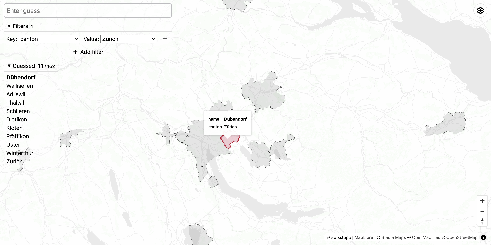

# Cartoquiz

A simple site to test your geography knowledge using custom geodata.



## About the project

Having spent countless hours playing [geography quizzes online](#acknowledgements), I found myself wanting a quizzing experience where:
1. geodata could be loaded dynamically, so the user is not locked to the dataset preconfigured by the quiz creator; and
1. data is displayed on an interactive, mapping app-like UI instead of a static view, so the user can perform actions like panning and zooming to view the quiz geodata in full detail.

This project is a simple app aimed at fulfilling this personal desire.

### Main features

- Quizzes configurable using custom geodata with [various vector formats](https://github.com/bugra9/gdal3.js?tab=readme-ov-file#vector).
- Interactive map to view and explore the quiz geodata.
- Quiz progress auto-saved to browser storage.

### Software design

I have used this project to challenge myself to building a very bare-bones, vanilla-as-reasonably-possible no-build frontend setup.
Some of the browser-native technologies used are:
- Vanilla JS with JSDoc for type management.
- Custom Web Components instead of an established frontend framework.
- CDNs + [import map](https://developer.mozilla.org/en-US/docs/Web/HTML/Element/script/type/importmap) to avoid needing an installation step. (The `devDependencies` in `package.json` only exists to aid with type hinting.)
- IndexedDB for persistent storage of quiz progress.


## How to play

To run locally, clone this repository and spin up a server from the root directory.
```sh
npx http-server
```

### Configuring the quiz

Start the quiz by filling out the required fields on the landing screen.

1. Load your desired dataset from a remote URL or local file. (This may take a while depending on file size.)
   
   Alternatively, choose from one of the available presets.

1. Select the dataset layer which contains the features you wish to quiz yourself on.

1. Select the feature property which you will be typing to make guesses.

   For example, if the features in your dataset have [`properties`](https://datatracker.ietf.org/doc/html/rfc7946#section-3.2:~:text=A%20Feature%20object%20has%20a%20member%20with%20the%20name%20%22properties%22.) of the following shape:
   ```json
   {
     "name": "Melbourne",
     "state": "Victoria",
     "population": 5000000
   }
   ```
   then you can quiz yourself on either the `name`, `state`, or `population` properties.

   If the `name` property is selected, you would have to input 'melbourne' (case insensitive) to successfully guess this feature during the quiz.

1. Press Start.

### Making guesses

Type your guess in the large input field marked 'Enter guess', then hit Enter.

#### Filtering

If multiple features match your guess, all of them will become marked as guessed. Set filters to reduce the chances of this behaviour making unintentional guesses for you.

Note that multiple filters work as AND-filters, i.e. your input is only compared against the set of features which satisfy **all** filters currently set.

### Resuming and restarting

Quiz progress is auto-saved to your browser's local IndexedDB storage, so you may leave the site at any time and reopen it later to continue from where you left off (as long as the site's data is not deleted from the browser, either automatically or via something like a 'clear cookies and site data' action).

To end the current quiz and start a new one, click on the gear icon in the top-right corner to switch to the quiz configuration view.
The previous quiz will be lost only when you configure a new quiz and press Start again.


## Acknowledgements

This project was inspired by geography quizzes on [Sporcle](https://www.sporcle.com/), [JetPunk](https://www.jetpunk.com/), and Ian Fisher's [CityQuiz.io](https://cityquiz.io/).

### Data

- Swiss canton and municipality data extracted from the [2025 swissBOUNDARIES3D](https://www.swisstopo.admin.ch/en/landscape-model-swissboundaries3d) dataset.
  [©swisstopo](https://www.swisstopo.admin.ch/en/terms-of-use-free-geodata-and-geoservices).

- German state and municipality data extracted from the [VG250](https://gdz.bkg.bund.de/index.php/default/verwaltungsgebiete-1-250-000-stand-01-01-vg250-01-01.html) dataset.
  © [BKG](https://www.bkg.bund.de/) (2024) [dl-de/by-2-0](https://www.govdata.de/dl-de/by-2-0).

- Japanese prefecture data extracted from the [日本 都道府県:高解像度TopoJSON](https://geoshape.ex.nii.ac.jp/city/choropleth/jp_pref.html) dataset.
  『歴史的行政区域データセットβ版』（CODH作成）, [CC BY-SA 4.0](https://creativecommons.org/licenses/by-sa/4.0).

- Japanese municipality data extracted from the [日本 市区町村（政令指定都市統合版）:高解像度TopoJSON](https://geoshape.ex.nii.ac.jp/city/choropleth/jp_city_dc.html) dataset.
  『歴史的行政区域データセットβ版』（CODH作成）, [CC BY-SA 4.0](https://creativecommons.org/licenses/by-sa/4.0).

### Map

- Rendering: [MapLibre GL JS](https://maplibre.org/)
- Tiles: [Stadia Maps](https://stadiamaps.com/) (tile provider), [OpenMapTiles](https://openmaptiles.org/), [OpenStreetMap](https://www.openstreetmap.org/copyright)

### Other

- Geodata format conversion: [gdal3.js](https://github.com/bugra9/gdal3.js)
